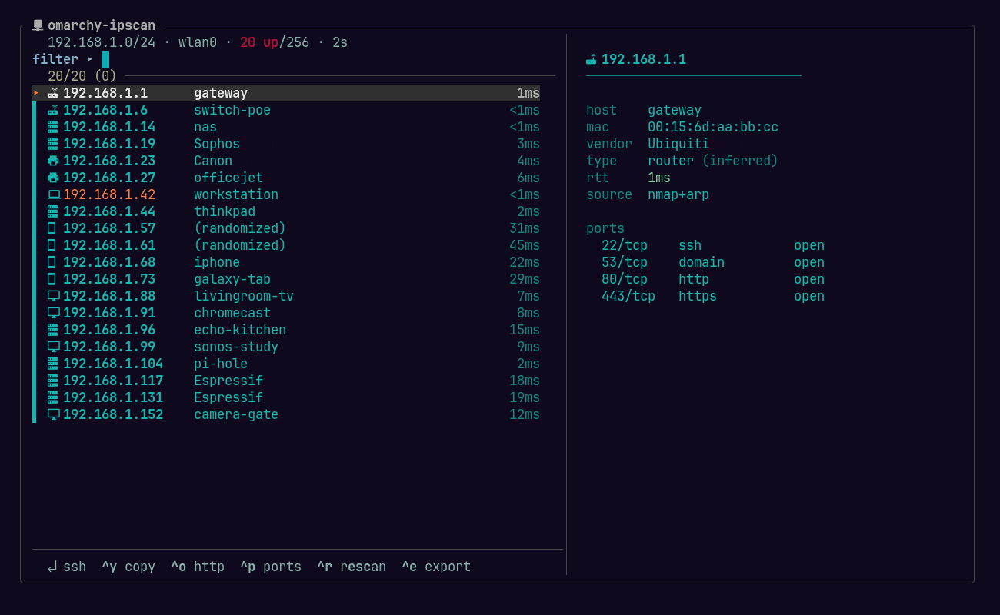

# omarchy-ipscan

A terminal-native network scanner for [Omarchy](https://omarchy.org) — an Angry IP
Scanner replacement that never leaves the keyboard.

It sweeps a subnet with `nmap`, enriches the results with MAC addresses and hardware
vendors, and drops you into an `fzf` picker where you can ssh into a host, copy its
address, open it in a browser, or port-scan it. No GUI, no daemon, and **no root**.



<sub>Example data. Device-specific MAC octets are placeholders; the OUI prefixes are
genuine vendor registrations, so the vendor column shows what a real scan would.</sub>


## Why

Angry IP Scanner is the tool most people reach for to answer "what is actually on
this network right now?" — but it is a Java desktop app, which is a strange thing to
open on a tiling-window-manager setup where everything else is a terminal.

`omarchy-ipscan` answers the same question without leaving the keyboard, and then
lets you *act* on the answer. Finding the host is usually not the goal; sshing into
it, grabbing its IP, or checking what it has open is. Typical uses:

- **What is on this network?** — plug into an unfamiliar LAN and get a named,
  vendor-labelled inventory in about two seconds.
- **Find the device you just plugged in** — the printer, the NAS, the Pi with no
  screen. The vendor column usually identifies it on sight.
- **Jump straight in** — highlight a host, press Enter, you are sshed in.
- **Grab an address** — `ctrl-y` copies it to the clipboard for a config file.
- **Quick triage** — `ctrl-p` port-scans a single host without leaving the picker.
- **Feed other tools** — `--quiet` prints plain TSV, `--csv` / `--json` export.

## Features

- Targets by CIDR (`192.168.10.0/24`), range (`192.168.10.1-50`), single IP, or
  hostname — or auto-detects your subnet from the default route.
- MAC address and hardware vendor per host, without root.
- Reverse DNS for every host, resolved in parallel.
- Device-type inference (router / printer / phone / display / server) from the vendor.
- Fuzzy filtering, multi-select, and a live detail pane.
- On-demand port scan of the highlighted host.
- CSV and JSON export, plus a pipe-friendly quiet mode.
- Theme-aware: inherits your terminal's colours instead of hardcoding any.

## Requirements

| Package        | Required | Used for                                          |
|----------------|----------|---------------------------------------------------|
| `bash` ≥ 4.3   | yes      | the script itself                                 |
| `nmap`         | yes      | host discovery, and the OUI vendor database       |
| `gum`          | yes      | prompt, spinner, export chooser                   |
| `fzf` ≥ 0.60   | yes      | the result picker (uses `--footer`)               |
| `arp-scan`     | no       | MAC addresses; also finds hosts that ignore ICMP  |
| `fping`        | no       | fallback sweep when `nmap` is absent              |
| `wl-clipboard` | no       | `ctrl-y` copy (`xclip` also works)                |
| `jq`           | no       | prettier JSON export (falls back to awk)          |
| A Nerd Font    | no       | device glyphs (auto-detected, auto-disabled)      |

```bash
sudo pacman -S nmap gum fzf arp-scan fping wl-clipboard jq
```

Every optional dependency is detected at startup. A missing one drops a column or a
keybind — it never aborts the scan.

### On not needing root

`nmap -sn` runs unprivileged. `arp-scan` needs raw socket access, which on Arch is
granted by a file capability (`cap_net_raw`) rather than by sudo:

```bash
getcap "$(command -v arp-scan)"     # -> /usr/bin/arp-scan cap_net_raw=p
```

If that capability is missing, `omarchy-ipscan` says so once and continues without
the MAC and vendor columns. It never asks for a password and never escalates.

## Install

```bash
git clone https://github.com/vlambaard/omarchy-ipscan.git
cd omarchy-ipscan
./install.sh
```

`install.sh` symlinks the script into `~/.local/bin`, installs a desktop entry into
`~/.local/share/applications`, and reports which optional engines are present. It
writes nothing outside `$HOME` and never asks for root.

To install somewhere else:

```bash
BIN_DIR=~/bin APP_DIR=~/.local/share/applications ./install.sh
```

Or skip the installer entirely — it is a single self-contained script:

```bash
curl -fsSLO https://raw.githubusercontent.com/vlambaard/omarchy-ipscan/main/omarchy-ipscan
chmod +x omarchy-ipscan && ./omarchy-ipscan
```

### Uninstall

```bash
rm ~/.local/bin/omarchy-ipscan ~/.local/share/applications/omarchy-ipscan.desktop
```

## Usage

```bash
omarchy-ipscan                            # auto-detect the subnet, confirm, browse
omarchy-ipscan 192.168.10.0/24            # CIDR
omarchy-ipscan 192.168.10.1-50            # hyphen range
omarchy-ipscan 192.168.10.1               # single host
omarchy-ipscan nas.local                  # hostname (resolved first)
omarchy-ipscan --csv hosts.csv            # headless export
omarchy-ipscan -q | awk -F'\t' '$2!="-"'  # only hosts with a reverse-DNS name
```

With no argument the subnet is taken from the **default route** and offered as a
prefilled prompt, so a bare invocation plus Enter does the right thing. Interfaces
that are not on the default route — docker and libvirt bridges in particular — are
deliberately ignored.

### Keybinds

| Key      | Action                                |
|----------|---------------------------------------|
| `enter`  | ssh to the highlighted host           |
| `ctrl-y` | copy selected IP(s) to the clipboard  |
| `ctrl-o` | open `http://<ip>` in the browser     |
| `ctrl-p` | port-scan the host (top 20 ports)     |
| `ctrl-r` | rescan the same target                |
| `ctrl-e` | export to CSV or JSON                 |
| `tab`    | multi-select                          |
| `ctrl-a` | select all                            |
| `?`      | toggle the detail pane                |
| `esc`    | quit                                  |

### Flags

```
-i, --iface IF        force the interface used for ARP discovery
    --csv FILE        write CSV and exit
    --json FILE       write JSON and exit
-p, --ports           port-probe every live host after the sweep
-q, --quiet           print "IP<TAB>hostname<TAB>MAC" and exit (also automatic
                      when stdout is not a TTY, so it pipes cleanly)
    --icons on|off|auto   device glyphs (default: auto-detect a Nerd Font)
-h, --help            full help, including keybinds
-V, --version         print version
```

### Output formats

`--quiet` is tab-separated with `-` for unknown fields:

```
192.168.10.1	_gateway	d4:01:c3:aa:bb:cc
192.168.10.178	-	50:03:cf:aa:bb:cc
```

`--json` emits `null` rather than a placeholder, so it parses cleanly:

```json
[{ "ip": "192.168.10.178", "hostname": null, "mac": "50:03:cf:aa:bb:cc",
   "vendor": "Canon", "latency_ms": 22.0, "type": "printer", "sources": "nmap+arp" }]
```

## Hyprland integration

**Omarchy 3.x and newer uses Lua config.** Add to `~/.config/hypr/bindings.lua`:

```lua
o.bind("SUPER + SHIFT + I", "IP Scanner", { tui = "omarchy-ipscan", focus = true })
```

`{ tui = ... }` routes through `omarchy-launch-tui`, which opens your default
terminal with Omarchy's styling. `focus = true` reuses an already-open window
instead of stacking a second scanner.

On **older releases that still use `~/.config/hypr/bindings.conf`**:

```ini
bind = SUPER SHIFT, I, exec, uwsm app -- xdg-terminal-exec --app-id=TUI.float -e omarchy-ipscan
```

Reload with `hyprctl reload`.

### Window sizing

The keybind produces the app-id `org.omarchy.omarchy-ipscan`, which is not in
Omarchy's stock floating list, so it tiles by default. To float it instead, add to
`~/.config/hypr/hyprland.lua`:

```lua
o.window("org\\.omarchy\\.omarchy-ipscan", { float = true })
o.window("org\\.omarchy\\.omarchy-ipscan", { center = true })
o.window("org\\.omarchy\\.omarchy-ipscan", { size = { 1300, 800 } })
```

Omarchy's stock `TUI.float` popup is 875x600, which measures 83 columns — below the
100-column threshold where the picker puts the detail pane *beside* the list rather
than below it. 1300x800 measures 125x34. Either works; the picker adapts to whatever
size it is given, down to about 60 columns.

## Design notes

**Vendors come from nmap, not arp-scan.** `arp-scan`'s bundled `ieee-oui.txt` is
stale and returns `(Unknown)` for most current hardware; nmap ships a ~52,000-entry
`nmap-mac-prefixes` that resolves the same addresses correctly. So MACs are read from
`arp-scan` and vendor names are looked up in nmap's database, in a single pass rather
than one grep per host.

**Both discovery sources are unioned.** `arp-scan` regularly finds hosts that drop
ICMP and never appear in an nmap ping sweep. Results from either engine are merged,
then clipped to the requested range — `arp-scan` always sweeps the whole local
subnet, so a narrow target would otherwise return hosts outside it. The `sources`
field records which engine saw each host.

**Randomised MACs are labelled, not misattributed.** An address with the
locally-administered bit set has no real manufacturer, so it is shown as
`(randomized)` rather than matched against a meaningless OUI. Modern phones use these
by default.

**Device types are inferred, and say so.** The class in the detail pane is a guess
derived from the vendor string, and is marked `(inferred)`.

**Theme-aware by construction.** Only ANSI colours 0–15 and `gum`/`fzf` defaults are
used — no hardcoded hex. Omarchy themes recolour the terminal, and fixed values would
clash with every theme but the one they were chosen for. `NO_COLOR` is honoured and
output is plain whenever stdout is not a TTY.

**Icons degrade.** Device glyphs are drawn from a single Nerd Font range (`nf-md`) so
every glyph has the same display width and columns stay aligned. Without a Nerd Font
they are dropped automatically; `--no-icons` forces that.

**Cleanup is not best-effort.** Scratch files live in one `mktemp -d` removed by an
`EXIT` trap, and `INT`/`TERM`/`HUP`/`QUIT` reap the whole child tree — so Ctrl-C
mid-sweep, or closing the terminal window, leaves no stray `nmap` behind and restores
the cursor. Long-running stages are backgrounded and waited on, because bash defers
trap handling while a foreground child is running.

## Troubleshooting

**No MAC or vendor column.** `arp-scan` is missing, or lacks `cap_net_raw`:
`sudo setcap cap_net_raw+p "$(command -v arp-scan)"`.

**Wrong subnet detected.** Detection follows the default route. Pass a target
explicitly, or use `-i <iface>`.

**Hosts missing.** Some devices only answer ARP. Install `arp-scan` — the union of
both engines finds considerably more than either alone.

**No glyphs, or misaligned columns.** Install a Nerd Font, or run with `--no-icons`.

**Debugging.** `OIPS_KEEP=1 omarchy-ipscan …` keeps the scratch directory and prints
its path.

## Development

```bash
shellcheck -S style omarchy-ipscan install.sh   # clean at the strictest level
bash -n omarchy-ipscan
```

The script is a single self-contained file with no build step. Issues and pull
requests welcome.

## License

MIT — see [LICENSE](LICENSE).
